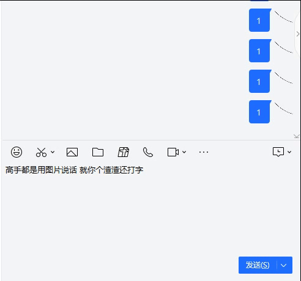

可将文字转成图片(表情)，让你在斗图中立于不败之地，实在是居家旅行（浪费流量）必备插件。

结合超级面板使用体验极佳（在聊天框内选中文本，打开超级面板，直接转为表情！）

添加表情模板：把图片调整好分辨率后放入imgs文件夹

### 更新日志
v0.0.6
1. 文字大小改为根据分辨率自动调整，优化默认字体大小和行间距
2. 支持自定义单行文字个数、行间距

v0.0.5
1. 支持用户自定义正则表达式用于匹配文本（如让插件在需要时弹出而不是输任意文本都弹出）

v0.0.4
1. ts重构
2. 增加本地配置图片模板的功能

v0.0.2 

 感谢@zhh904208603
1. 兼容MacOS
2. 添加更多表情模板
